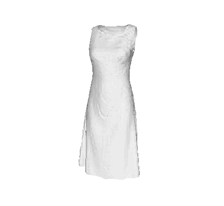
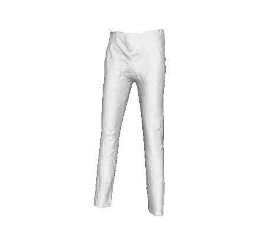

# MeshUDF: Fast and Differentiable Meshing of Unsigned Distance Field Networks

 

This is the PyTorch implementation of the ICCV 2022 paper [MeshUDF](https://bguillard.github.io/meshudf/). We provide one dummy pre-trained UDF network and code for demonstrating our differentiable meshing procedure of open surfaces.

The below instructions describe how to:
1. [Setup the Python environment](#setup-environment)
2. [Launch optimization from one piece of garment to another](#Launch-reconstruction-and-optimization)


## Setup environment
Set up a conda environment with the right packages using:
```
conda env create -f conda_env.yml
conda activate meshudf
```

For speed purposes, our modified version of marching cubes is implemented in Cython. It is largely based on [scikit-image implementation](https://github.com/scikit-image/scikit-image/blob/main/skimage/measure/_marching_cubes_lewiner_cy.pyx) of marching cubes Lewiner. To compile the custom version for your system, please run:
```
cd custom_mc
python setup.py build_ext --inplace
cd ..
```

## Launch reconstruction and optimization

The provided UDF network under `trained_networks/udf_4_garments/` is an auto-decoder which was trained on 4 different items of garment (0:dress, 1:jeans, 2:sweater, 3:tshirt). In `optimize_chamfer_A_to_B.py`, we use our method to reconstruct garments associated to latent codes `A` and `B`. We then optimize latent code `A` such that its corresponding mesh is similar to the one of `B`. This is done by applying a 3D Chamfer loss directly on the meshes, thus demonstrating the end-to-end differentiability of our method.

For example, to launch the reconstruction and optimization from a pair of jeans to a tshirt, run:
```
python optimize_chamfer_A_to_B.py --experiment trained_networks/udf_4_garments --A 1 --B 3
```


## Credits and citation
Feel free to use this code for academic work, but please cite the following:
```
@inproceedings{guillard2022udf,
  author = {Guillard, Benoit and Stella, Federico and Fua, Pascal},
  title = {MeshUDF: Fast and Differentiable Meshing of Unsigned Distance Field Networks},
  booktitle = {European Conference on Computer Vision},
  year = {2022}
}
```

This code is based on the repos of [DeepSDF](https://github.com/facebookresearch/DeepSDF) and [scikit-image](https://github.com/scikit-image/scikit-image), whose authors we warmly thank.
